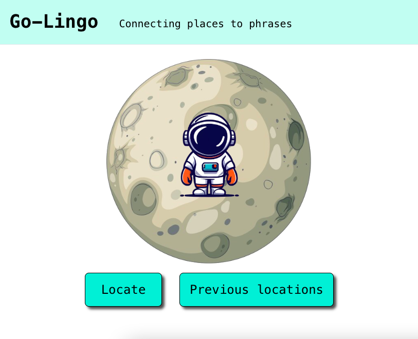
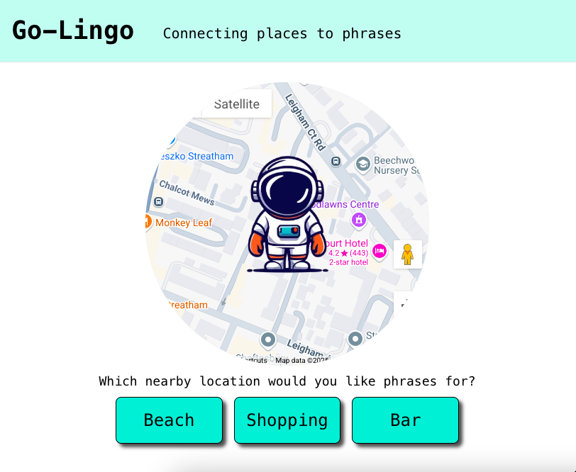

# Go-Lingo project

### Technologies used

- Python
- Django
- FourSquare API

The aim of Go-Lingo is to provide the user with relevant phrases based on their location, Eg. If they are at a coffee shop they will be given useful phrases on how to order a coffee.



1. You start off by providing coordinates which will then retrieve nearby places. I have achieved this by using the FourSquare API. This will return a number of places, and each place has a category.

Example of place data returned from FourSquare
```json
{
    "results": [
        {
            "name": "Aruba",
            "fsq_id": "4b76c5d2f964a5201d5e2ee3",
            "categories": [
                {
                    "id": 13009,
                    "name": "Café"
                }
            ]
        }
    ]
}
```
2. I then go through each category and try to match the name with a location category in the database. I will then return the location name.

Example of a Location in the database (The above data would match with cafe and return coffee shop)
```json
{
    "name": "Coffee shop",
    "categories": [
        "Internet Cafe",
        "Bakery",
        "Breakfast Spot",
        "Cafe",
        "Bubble Tea",
        "Cafe Dining",
        "Coffee Shop",
        "Pet Café",
        "Café",
        "Tea Room"
    ]
}
```
Example of API response
```json
{
    "locations": [
        "Coffee Shop",
        "Restaurant"
    ]
}
```
3. Once you return the locations the idea is that the user will click which location they would like phrases for. They will then call getPhraseByLocation(). This will return all phrases with the correct location.



Example of response when choosing coffee shop
```json
[
    {
        "id": 1,
        "english_phrase": "What do you want to drink?",
        "spanish_phrase": "Que quieres beber?",
        "location": 1
    }
]
```

### To do
1. Phrases currently include the english and spanish translations of a sentence as I dont know any more languages unfortunately, but I have created it to be able to add more language fields as the project grows
